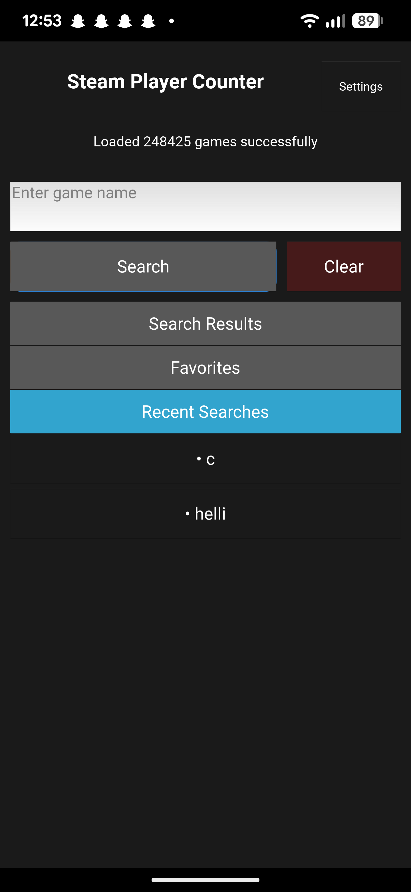

# Online Steam

A simple Python app that shows how many people are currently playing a specific Steam game — using data from SteamDB.

## Features

- Search for any game available on Steam
- See how many players are online right now
- Terminal and GUI versions available (GUI with Kivy)
- Fast and lightweight

## Screenshots

### Terminal Version



### GUI Version


## Installation

### Requirements

- Python 3.10+
- pip

### Install dependencies

```bash
pip install -r requirements.txt
